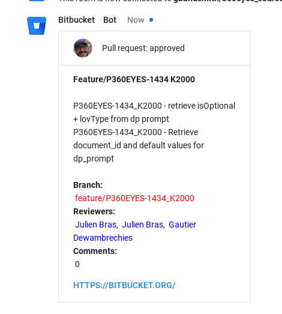
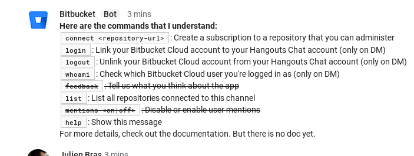

# Bitbucket Chat Bot

_The missing link between BitBucket and Hangouts Chat._



**This bot is able to give you info about [BitBucket](https://bitbucket.org) PR on a [Google Hangouts Chat](https://chat.google.com/) room.**

## Requirements

This tool rely on **NodeJS** with a **MongoDB** backend. You also need to create
a google project to auth your bot on Hangout Chat, and a BitBucket auth. Here is
how to do this.

### Create Hangout Chat project

Follow google-hangouts-chat publish procedure [here](https://developers.google.com/hangouts/chat/how-tos/bots-publish)

In the configuration you need to provide:
* __Bot name__ Will be the visible name of the bot (_Bitbucket_ for example)
* __Avatar URL__ Will be the icon of the bot (must be an URL)
* __Description__ Will be the description of the bot visible to end users
* __Bot URL__ The endpoint of the bot for hangout. Need to be ``https://hostname/hangouts/receive``
(during developement phase you can use service like [Serveo](https://serveo.net/) to map your local computer)
* __Verification token__ Will be a random string to check that the query is coming from Google

Then you have to keep somewhere the json file generated AND the verification
token. It will be used later.

### Create Bitbucket OAuth consumer

You must declare your bot as a 'OAuth consumer' to allow it oauth on behalf of third
part users. It is described [here](https://confluence.atlassian.com/bitbucket/oauth-on-bitbucket-cloud-238027431.html).

* In Bitbucket, go to 'View profile' then 'Settings' then 'OAuth'
* Click on 'Add Consumer'
 * __Name__ Name of your consumer (_Google Hangouts Chat_ for example)
 * __Description__ A description
 * __Callback URL__ Must be ``https://hostname/bitbucket/oauth`` ([Serveo](https://serveo.net/) can be used here too)
 * Provide optional urls if you want
 * Keep the consumer public (don't check 'This is a private consumer')
 * In __Permissions__ check:
   * Account: Email
   * Account: Read
   * Pull requests: Read
   * Repositories: Read
   * Repositories: Admin
   * Webhooks: Read and write
 * Save it

Then  you will have access to the ``Key`` and the ``Secret`` of your consumer.
It will be used later.

## Running bitbucket-chat-bot locally

Create a .env file (it will be read by ``bot.js``) that will contain all
environement variables. You can use ``.env.default`` as exemple:

```
GOOGLE_APPLICATION_CREDENTIALS=/path/to/bitbucket-chat-bot-testing.json (must point to the json file)
GOOGLE_VERIFICATION_TOKEN=google-verification-token (set in google api)
BB_OAUTH_KEY=bitbucket-oauth-consumer-key (from bitbucket consumer)
BB_OAUTH_SECRET=bitbucket-oauth-consumer-secret (from bitbucket consumer)
HOSTNAME=https://hostname
```

The environment variable ``MONGO_URL`` must contain a valid mongo DB url. If the
variable is not set then it is set by default to `mongodb://localhost/bb` (so
you must have mongo installed on your local computer). You can get a MongoDB
hosted [here](https://mlab.com/welcome/) for example.

```
npm install
npm start
```

I really recommand to use [serveo](https://serveo.net/) to allow bitbucket and
hangout to be able to communicate with your local computer during developement.
It will expose your local server on the internet temporally. Just run in a
command prompt:

```
ssh  -o ServerAliveInterval=60 -R 80:localhost:3000 serveo.net
```
And your local 3000 port will be exposed on a subdomain of serveo in HTTPS.

If you want to reuse always the same subdomain just do:

```
ssh  -o ServerAliveInterval=60 -R mysubdomain:80:localhost:8888 serveo.net
```

Then you can just provide ``mysubdomain.serveo.net`` as your ``hostname`` in
google configuration, bitbucket configuration and bot configuration.

## Testing

### Unit tests

```
npm test
```

### Testing bitbucket endpoints

Once started locally you can launch queries to simulate bitbucket interactions.
Here using [httpie](https://httpie.org/):

```
# New pull request
http :3000/bitbucket/hook space==4LWz7AAAAAE x-event-key:pullrequest:created @test/data/created.json
# New comment on pull request
http :3000/bitbucket/hook space==4LWz7AAAAAE x-event-key:pullrequest:comment_created @test/data/comment.json

```

## Deploy

Here is how to deploy on Dokku like systems:

```
git remote add dokku dokku@dokkuhost:appname
git push dokku
```

### On dokku host:

The environment variable ``$CREDS`` must contains the google credentials for sending
messages to Hangouts Chat. Tip from [here](https://github.com/googleapis/google-auth-library-nodejs/blob/master/README.md#loading-credentials-from-environment-variables). (Dokku can't read the json file directly)

You need to provide all env variable to the dokku application like that:

```
# setup letencrypt for https access
dokku config:set --no-restart appname DOKKU_LETSENCRYPT_EMAIL=myemail
dokku letsencrypt appname

# setup mongo (it create the MONGO_URL automatically)
sudo dokku plugin:install https://github.com/dokku/dokku-mongo.git mongo
dokku mongo:create mongo-bitbucket
dokku mongo:link mongo-bitbucket appname

# add google credentials (content of json file)
dokku config:set appname CREDS='{
  "type": "service_account",
  "project_id": "your-project-id",
  "private_key_id": "your-private-key-id",
  "private_key": "your-private-key",
  "client_email": "your-client-email",
  "client_id": "your-client-id",
  "auth_uri": "https://accounts.google.com/o/oauth2/auth",
  "token_uri": "https://accounts.google.com/o/oauth2/token",
  "auth_provider_x509_cert_url": "https://www.googleapis.com/oauth2/v1/certs",
  "client_x509_cert_url": "your-cert-url"
}'
# add google verif token
dokku config:set appname GOOGLE_VERIFICATION_TOKEN='your-verification-token'
# add bitbucket credentials
dokku config:set appname BB_OAUTH_KEY='oauth-key'
dokku config:set appname BB_OAUTH_SECRET='oauth-secret'

# add hostname
dokku config:set appname HOSTNAME='https://hostname'
```

### Setup the Hangout Chat Bot


### Speak to the bot

Speak to the bot:



As of today you can:
- login to BB
- connect to a existing repository
- list repos connected to current channel
- show the help message !


## Technical documentation

Here is the description of each endpoint in the application.

- ``/hangouts/receive``: This endpoint is managed by the ``botkit`` framework. It is set in the Google Hangout Chat configuration. Hangout will speak to the bot via this endpoint.
- ``/bitbucket/hook``:  This endpoint is used by the BitBucket webhook system. When the bot is connected to  a repo, it create a webhook with this endpoint in the repo configuration. There is always the ``space`` parameter specified that is the id of the room where the repo is connected.
- ``/bitbucket/oauth``: This endpoint is used during the BitBucket user authentication. It allow to login and store the user token for later usage.